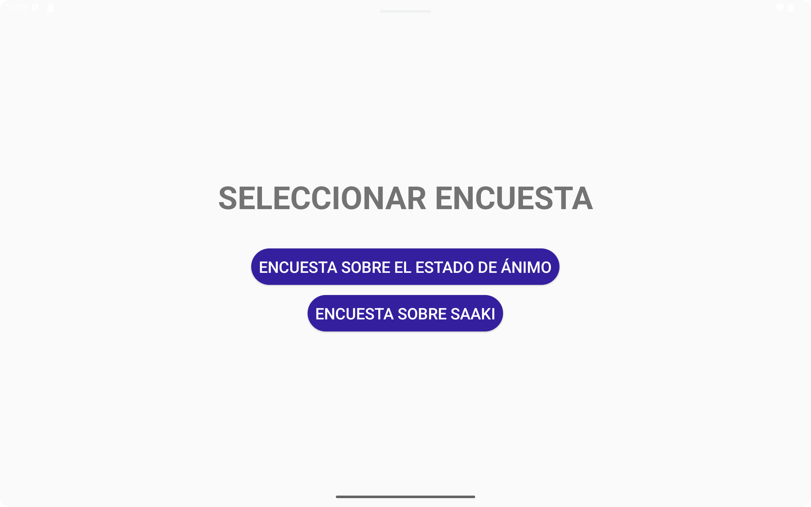
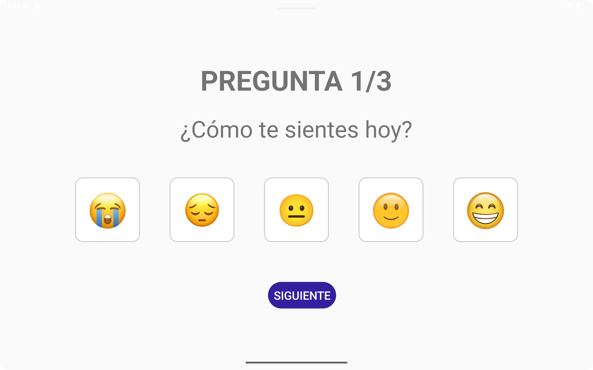
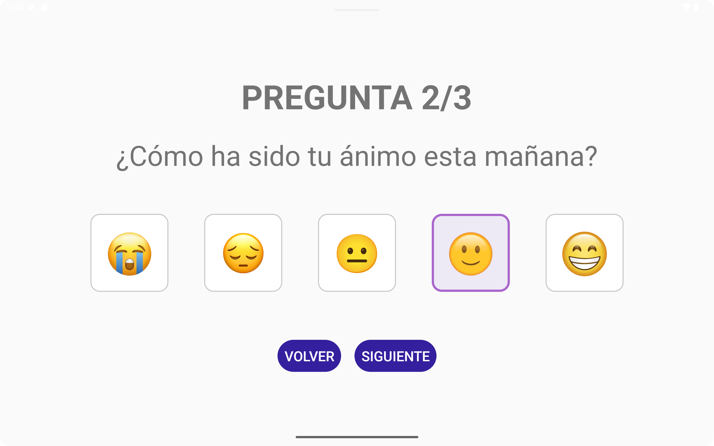
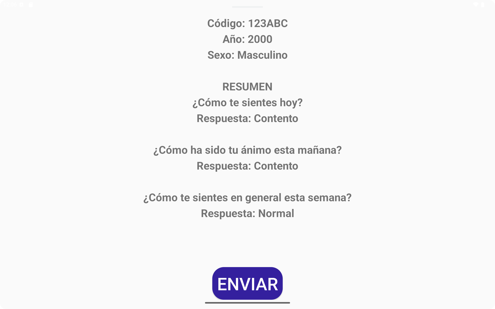
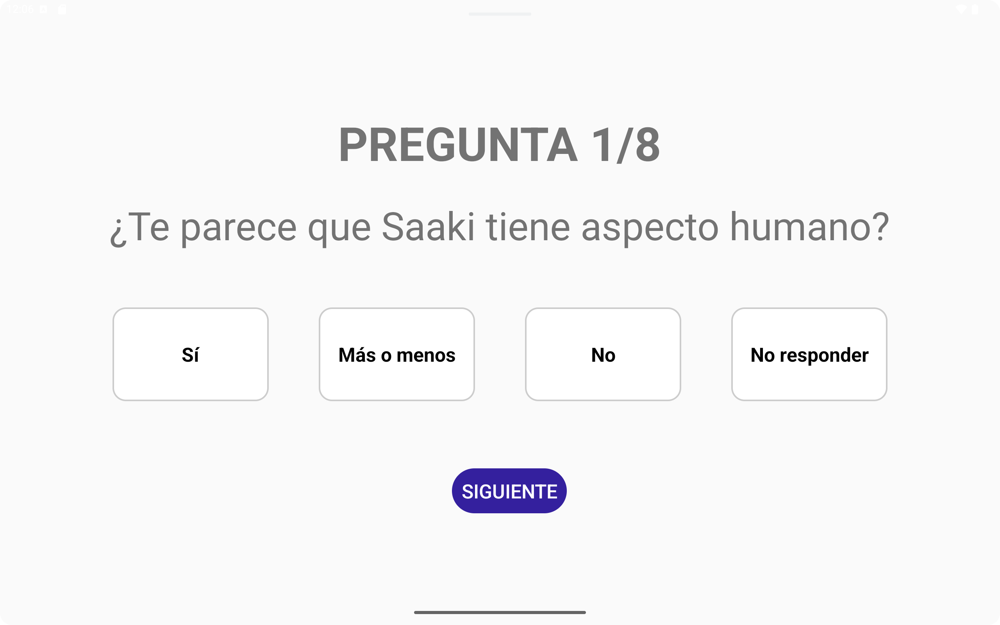
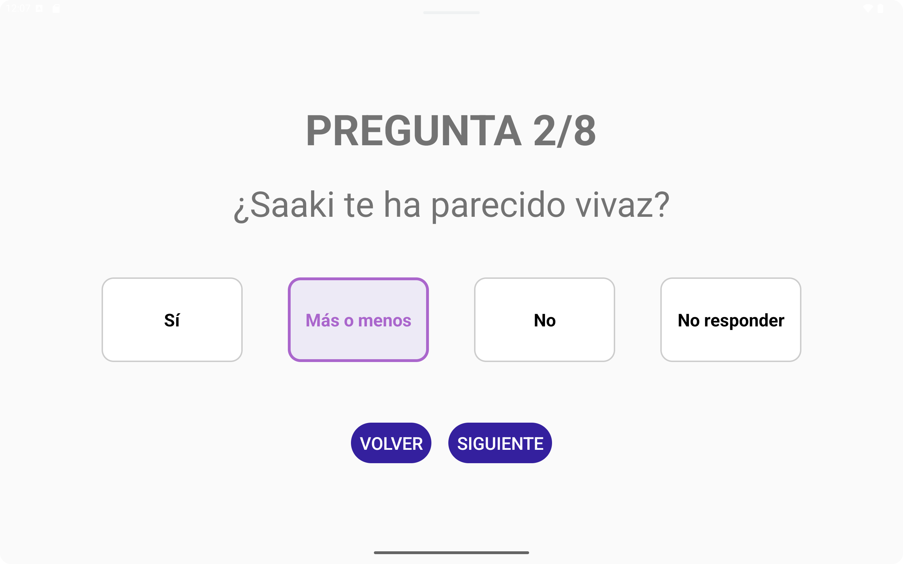
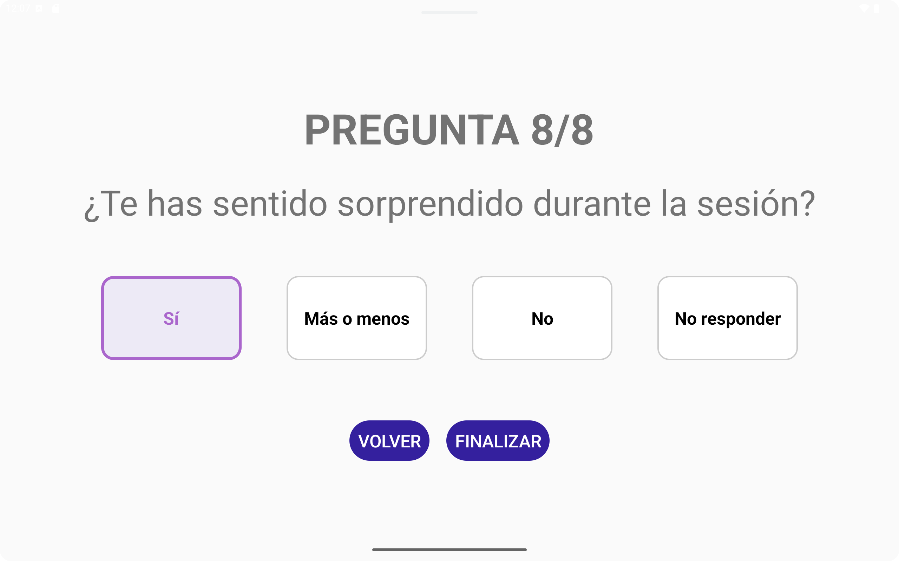
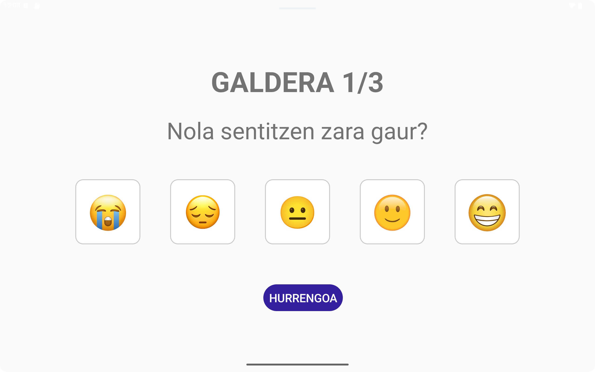
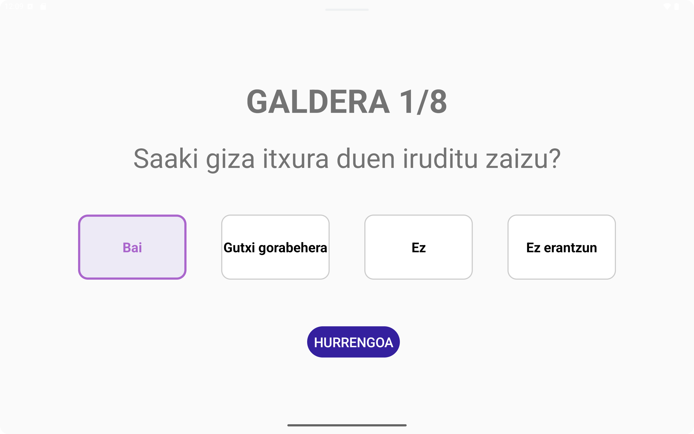
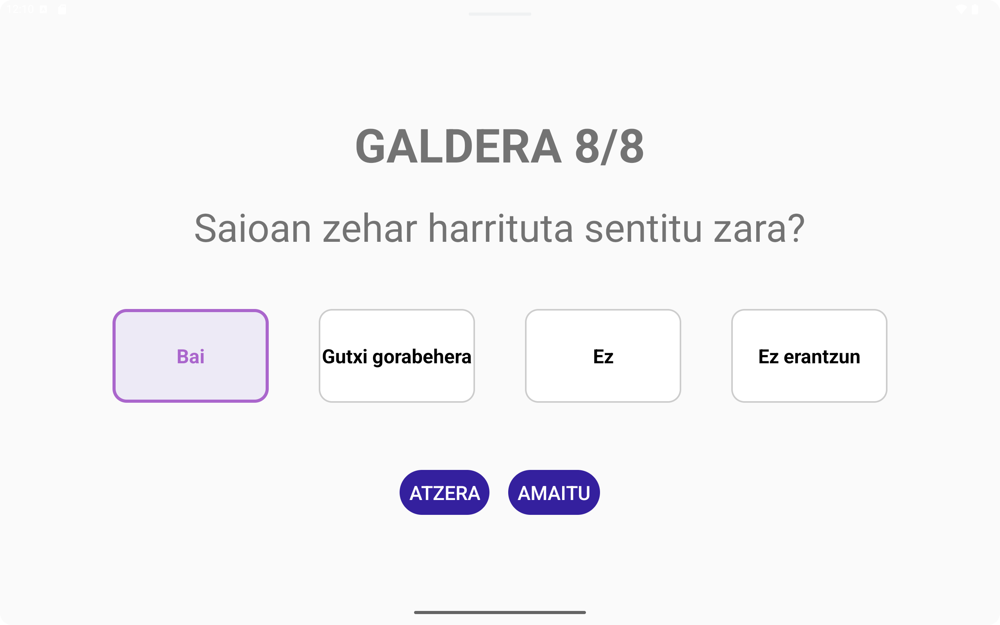

# APP de encuestas para Saaki

Este documento describe **cómo reproducir la APP de encuestas** en otro equipo.

## 🧠 Requisitos previos

Asegúrate de tener instalado Android Studio en tu sistema

---

## ♻️ Reproducir el entorno en otro equipo

1. Instalar dependencias base:

   ```bash
   sudo apt update && sudo apt install openjdk-17-jdk git qemu-kvm libvirt-daemon-system libvirt-clients bridge-utils virt-manager -y
   ```

2. Instalar Android Studio (`snap install android-studio --classic`)
3. Clonar el proyecto:

   ```bash
   git clone https://github.com/UAI-BIOARABA/EncuestasSaaki.git
   ```

4. Abrir el proyecto en Android Studio
5. Android Studio descargará automáticamente el SDK y las librerías Gradle necesarias
6. (Solo para dispositivos físicos) En caso de necesitar un SDK específico para un dispositivo, ir a 'Tools → SDK Manager' y ahí buscar el SDK para la versión de Android del dispositivo. Como ejemplo, en nuestro caso, disponemos de una tablet con Android 6.0, por lo que necesitamos descargar el SDK 23 para Android 6.0 (Marshmallow).

---

## ✅ Verificación final

Para comprobar que todo funciona:

1. Abre el proyecto
2. Espera la sincronización de Gradle
3. Click en:

   ``` Andorid Studio
   Build → Clean Project
   ```

   Después click en:

   ``` Android Studio
   Build → Assemble 'app' Run Configuration
   ```

4. Abre el emulador o conecta un dispositivo físico
5. Pulsa **Run ▶️** en Android Studio

Si la app se ejecuta correctamente: ¡el entorno se ha reproducido con éxito! 🎉

---

## 🧩 Exportar configuración del IDE (opcional)

Desde Android Studio:

``` Android Studio
File → Manage IDE Settings → Export Settings...
```

Esto genera un `.zip` que puedes importar en otro equipo con:

``` Android Studio
File → Manage IDE Settings → Import Settings...
```

---

## 📸 Imagenes de la APP

### 🟥🟨🟥 CASTELLANO

#### Inicio


#### Introducción de datos


#### Selección de encuesta



#### Encuesta A





#### Resumen A



#### Encuesta B





#### Resumen B


### ⬜🟩🟥 EUSKARA

#### Hasiera


#### Datuak sartzea


#### Inkestaren hautaketa


#### Inkesta A




#### Laburpena A


#### Inkesta B





#### Laburpena B


---

## 💾 Cómo se guardan los datos

Por motivos como facilidad de lectura y edición, simplicidad en el almacenamiento o exportación y análisis de respuestas, esta app almacena los datos de usuarios y las respuestas a las encuestas en **formatos CSV**.

Para guadar los archivos usamos:

```Kotlin
val file = File(requireContext().getExternalFilesDir(null), "usuarios.csv")
```

Entonces, los archivos se almacenan en el almacenamiento privado externo de la app, en la siguiente ruta:

``` Files
/storage/emulated/0/Android/data/com.example.encuestassaaki/files/
```

Dentro de esa carpeta se encontrarán los siguientes archivos:

``` Files
usuaios.csv
encuesta_a.csv
encuesta_b.csv
us.bak (backup de usuarios)
ea.bak (backup de encuestas_a)
eb.bak (backup de encuestas_b)
```

Ya que nuestro dispositivo ustiliza Android 6.0, podemos acceder a estos archivos desde el propio explorador de archivos de la tablet, lo cual simplifica mucho el acceso a los datos y no necesitamos añadir funcionalidades para exportarlos.

---

## 💾 Cómo se ven los datos almacenados

Los datos se almacenan de la siguiente forma en los archivos CSV:

### Usuarios


### Encuesta_A


### Encuesta_B


---

### 🚨 No almacenamos emoticonos, almacenamos numeros en la escala de 1 a 5 🚨

### 🚨 Los datos se almacenan en castellano independientemente del idioma seleccionado 🚨
