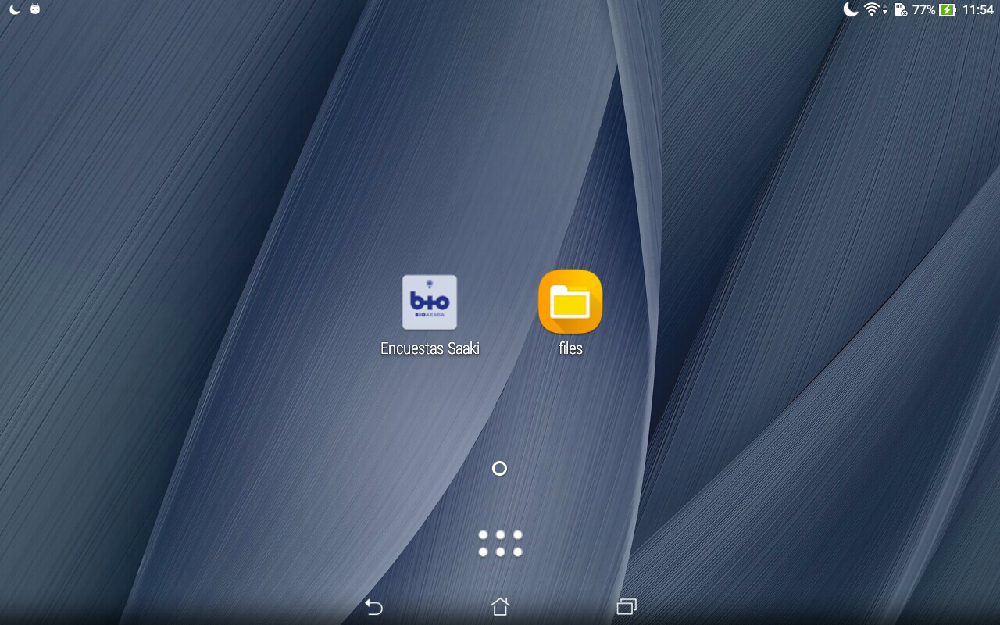
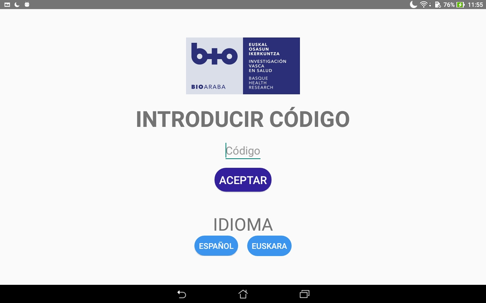
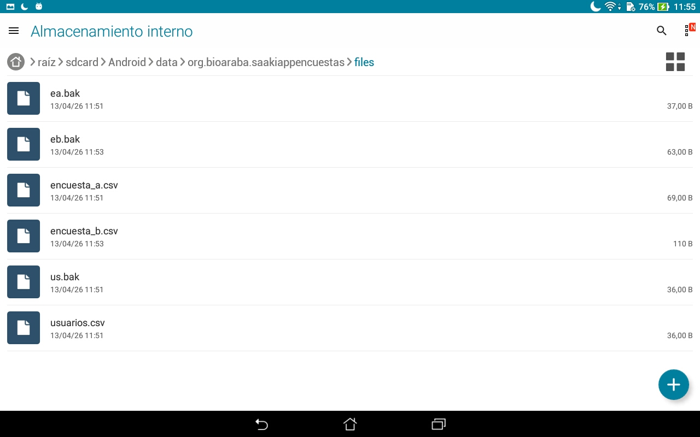

<div align="center">

<h1> APP de Encuestas para Saaki - Unitree G1 </h1>

<p align="center">

[](README.md)
[](README_es.md)

</p>

[](https://developer.android.com/)
[](https://kotlinlang.org/)
[](https://gradle.org/)


[](https://opensource.org/licenses/MIT)
</div>

## 📖 Descripción

Este repositorio contiene una aplicación Android de carácter experimental, desarrollada en el contexto del proyecto Saaki con fines exclusivamente de prueba y evaluación preliminar.

No se trata de una versión final ni está destinada a su uso en entornos reales, productivos o asistenciales.

Los contenidos incluidos (preguntas y respuestas) se han elaborado tomando como referencia encuestas existentes, con fines ilustrativos y sin validación para su uso clínico o científico.

La aplicación está concebida para un uso local e interno, ejecutándose en un único dispositivo sin transmisión externa de datos. No obstante, este repositorio no garantiza el cumplimiento de requisitos legales, de seguridad o de protección de datos necesarios para un uso en producción.

El desarrollo se ha realizado en euskera y castellano, siendo estos los únicos idiomas disponibles. La documentación interna y los comentarios en el código pueden encontrarse en cualquiera de estos idiomas.

Este README describe características de la aplicación y **cómo reproducir la APP de encuestas** en otro equipo.

---

## 🛠️ Requisitos previos

Asegúrate de tener instalado [Android Studio](https://developer.android.com/studio?hl=es-419) en tu sistema.

---

## ♻️ Reproducir el entorno en otro equipo

1. Instalar dependencias base:

   ```bash
   sudo apt update && sudo apt install openjdk-17-jdk git qemu-kvm libvirt-daemon-system libvirt-clients bridge-utils virt-manager -y
   ```

2. Instalar Android Studio (`snap install android-studio --classic`)
3. Clonar el proyecto:

   ```bash
   git clone https://github.com/UAI-BIOARABA/saaki-app-encuestas.git
   ```

4. Abrir el proyecto en Android Studio
5. Android Studio descargará automáticamente el SDK y las librerías Gradle necesarias
6. (Solo para dispositivos físicos) En caso de necesitar un SDK específico para un dispositivo, ir a 'Tools → SDK Manager' y ahí buscar el SDK para la versión de Android del dispositivo. Como ejemplo, en nuestro caso, disponemos de una tablet con Android 6.0, por lo que necesitamos descargar el SDK 23 para Android 6.0 (Marshmallow).

---

## ✅ Verificación final

Para comprobar que todo funciona:

1. Abre el proyecto
2. Espera la sincronización de Gradle
3. Click en:

   ``` Andorid Studio
   Build → Clean Project
   ```

   Después click en:

   ``` Android Studio
   Build → Assemble 'app' Run Configuration
   ```

4. Abre el emulador o conecta un dispositivo físico
5. Pulsa **Run ▶️** en Android Studio

Si la app se ejecuta correctamente: ¡el entorno se ha reproducido con éxito! 🎉

---

## 🧩 Exportar configuración del IDE (opcional)

Desde Android Studio:

``` Android Studio
File → Manage IDE Settings → Export Settings...
```

Esto genera un `.zip` que puedes importar en otro equipo con:

``` Android Studio
File → Manage IDE Settings → Import Settings...
```

---

## 📸 Imagenes de la APP

#### Hasiera


#### Datuak sartzea


#### Inkestaren hautaketa


#### Inkesta A


#### Laburpena A


#### Inkesta B


#### Laburpena B


---

## 🏠 Página de inicio del dispositivo

La página de inicio de nuestro dispositivo tendrá 2 iconos:
- La aplicación de encuestas
- Un atajo a la carpeta con los archivos guardados de la app



#### El icono de la aplicación de encuestas permite el acceso directo a la app



#### El atajo de archivos permite el acceso directo a la carpeta con los archivos guardados por la app de encuestas



---

## 💾 Cómo se guardan los datos

Por motivos como facilidad de lectura y edición, simplicidad en el almacenamiento o exportación y análisis de respuestas, esta app almacena los datos de usuarios y las respuestas a las encuestas en **formatos CSV**.

Para guadar los archivos usamos:

```Kotlin
val file = File(requireContext().getExternalFilesDir(null), "usuarios.csv")
```

Entonces, los archivos se almacenan en el almacenamiento privado externo de la app, en la siguiente ruta:

``` Files
/storage/emulated/0/Android/data/org.bioaraba.saakiappencuestas/files/
```

Dentro de esa carpeta se encontrarán los siguientes archivos:

``` Files
usuaios.csv
encuesta_a.csv
encuesta_b.csv
us.bak (backup de usuarios)
ea.bak (backup de encuestas_a)
eb.bak (backup de encuestas_b)
```

Ya que nuestro dispositivo ustiliza Android 6.0, podemos acceder a estos archivos desde el propio explorador de archivos de la tablet, lo cual simplifica mucho el acceso a los datos y no necesitamos añadir funcionalidades para exportarlos.

---

## 💾 Cómo se ven los datos almacenados

Los datos se almacenan de la siguiente forma en los archivos CSV:

### Usuarios


### Encuesta_A


### Encuesta_B


---

## 🚨 NOTAS IMPORTANTES

- No almacenamos emoticonos, almacenamos numeros en la escala de 1 a 5.
- Los datos se almacenan en castellano independientemente del idioma seleccionado.

---

## 🧑‍💻 Autores

- **Project Manager:** [Juan Fernández](https://github.com/jfbioaraba)
- **Lead Developer:** [Andoni González](https://github.com/andoni92)

---

## Descargo de responsabilidad

Este software y los materiales asociados se proporcionan “tal cual”, sin garantías de ningún tipo, ni expresas ni implícitas, incluyendo —pero no limitándose a— garantías de comercialización, idoneidad para un propósito particular o ausencia de errores.
 
Los/as autores/as y Bioaraba – Instituto de Investigación Sanitaria no asumen responsabilidad alguna por el uso, la redistribución o la modificación de este repositorio ni por los posibles daños directos o indirectos derivados de su utilización.
 
Este proyecto tiene fines exclusivos de investigación y/o docencia. No está destinado a su uso clínico, diagnóstico, terapéutico ni asistencial, ni sustituye herramientas certificadas ni la evaluación profesional en entornos sanitarios.
 
Sin perjuicio de lo anterior, el uso del software y del sistema robótico se realizará bajo la responsabilidad de la persona usuaria, quien deberá verificar previamente su idoneidad para el fin concreto y adoptar todas las medidas de seguridad, supervisión y control necesarias en función del entorno y condiciones de uso.

La persona usuaria será responsable de las consecuencias derivadas de un uso inadecuado, negligente o no conforme, incluyendo los posibles daños personales o materiales que pudieran producirse.

En la máxima medida permitida por la legislación aplicable, Bioaraba no asumirá responsabilidad por daños derivados del uso del software o sistema robótico cuando estos provengan de una implementación defectuosa, una supervisión insuficiente o una decisión de uso inapropiada por parte de la persona usuaria, así como por la inobservancia de las medidas de seguridad recomendadas.
